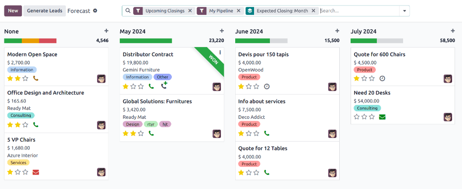

===============
Forecast report
===============

.. |caret| replace:: :icon:`fa-caret-down` :guilabel:`(down)` icon
.. |pivot| replace:: :icon:`oi-view-pivot` :guilabel:`(pivot)` icon
.. |list| replace:: :icon:`oi-view-list` :guilabel:`(list)` icon

The *Forecast* report in the *CRM* app allows users to view upcoming opportunities and build a
forecast of potential sales. Opportunities are grouped by the month of their expected closing
date, and can be dragged-and-dropped to adjust the deadline.

To access the *Forecast* report, navigate to :menuselection:`CRM app --> Reporting --> Forecast`.

View results
============

Click the :icon:`fa-area-chart` :guilabel:`(area chart)` icon to change to graph view.
Click the corresponding icon at the top of the report to switch to a :icon:`fa-bar-chart`
:guilabel:`(bar chart)`, :icon:`fa-line-chart` :guilabel:`(line chart)`, or :icon:`fa-pie-chart`
:guilabel:`(pie chart)`. Click the |pivot| to change to the *pivot* view, or the |list| to change to
the *list* view.

.. image:: forecast_report/pie-chart-view.png
   :align: center
   :alt: A pie chart view of the Forecast report.

.. seealso::
   To save this report as a *favorite*, see :ref:`search/favorites`.
